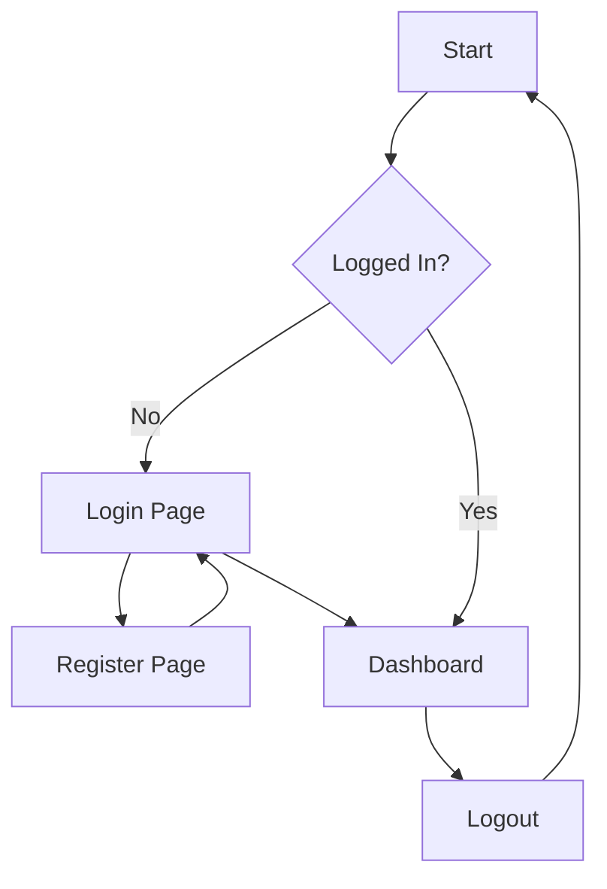

# Financial Dashboard Design Plan

## Requirements and Scope

- Simple financial dashboard website
- Pages: Registration, Login, Main Dashboard
- Dashboard features: Account balance, transaction history, fund transfer, add expense, add income, top 5 expenses, top 5 categories
- Add Expense: Fields for who performed the expense, payment method (12 predefined: Method 1 through Method 12), amount, description
- Add Income: Fields for who, source, amount, description
- Top 5 Expenses: Display highest or most recent expenses
- Top 5 Categories: Display top categories by spending
- Technology: Plain HTML, CSS, JavaScript
- Basic functionality, no advanced security (e.g., no encryption, simple validation)

## File Structure

```
family-financial/
├── index.html          # Entry point, redirects to login
├── register.html       # User registration page
├── login.html          # User login page
├── dashboard.html      # Main dashboard after login
├── css/
│   └── styles.css      # Global styles
├── js/
│   ├── app.js          # Common JavaScript functions
│   ├── register.js     # Registration page scripts
│   ├── login.js        # Login page scripts
│   └── dashboard.js    # Dashboard page scripts
└── assets/             # Images, icons (if needed)
```

## Page Layouts and Wireframes

### Registration Page (register.html)

Layout:
- Header: "Create Account"
- Form:
  - Username: input text
  - Email: input email
  - Password: input password
  - Confirm Password: input password
  - Register button
- Footer: Link to "Already have an account? Login"

Wireframe (Textual):
```
+-----------------------------+
|        Create Account       |
+-----------------------------+
| Username: [___________]     |
| Email:    [___________]     |
| Password: [___________]     |
| Confirm:  [___________]     |
| [Register]                  |
+-----------------------------+
| Already have account? Login |
+-----------------------------+
```

### Login Page (login.html)

Layout:
- Header: "Login"
- Form:
  - Username/Email: input text
  - Password: input password
  - Login button
- Footer: Link to "Don't have an account? Register"

Wireframe:
```
+-----------------------------+
|           Login             |
+-----------------------------+
| Username/Email: [_____]     |
| Password:       [_____]     |
| [Login]                     |
+-----------------------------+
| Don't have account? Register|
+-----------------------------+
```

### Enhanced Dashboard Page (dashboard.html)

#### Layout Overview
The enhanced dashboard adopts a modern layout with a fixed sidebar, top filters, summary cards, and a responsive bottom grid. It incorporates wireframe-style black borders, elder-friendly design (larger fonts, high contrast, clear labels), Indian currency formatting (₹), and mobile responsiveness.

#### Key Components
- **Fixed Left Sidebar**: 250px width on desktop, collapsible on mobile. Contains a prominent green "Add New Expense" button and optional navigation links.
- **Top Filter Section**: Centered controls with Month and Year dropdowns (pre-populated with current values) and an "Apply Filters" button.
- **Summary Cards**: Three cards displaying Total Income (green), Total Expenses (red), and Reminders (with count and "Add Reminder" button).
- **Bottom Panels**: Responsive grid with three panels:
  - Top 5 Expense Categories: List with amounts and progress bars.
  - Pie Chart: Chart.js visualization with tooltips.
  - Recent Transactions: Table with edit/delete icons.

#### HTML Structure Outline
```html
<body>
  <header>
    <h1>Welcome, [User]</h1>
    <button id="logout">Logout</button>
  </header>
  <div class="dashboard-container">
    <aside class="sidebar">
      <button class="add-expense-btn">Add New Expense</button>
      <!-- Optional nav links -->
    </aside>
    <main class="main-content">
      <section class="filters">
        <div class="filter-controls">
          <select id="month"><!-- Options for months --></select>
          <select id="year"><!-- Options for years --></select>
          <button id="apply-filters">Apply Filters</button>
        </div>
      </section>
      <section class="summary-cards">
        <div class="card income">Total Income: ₹0.00</div>
        <div class="card expenses">Total Expenses: ₹0.00</div>
        <div class="card reminders">Reminders: 0 <button>Add Reminder</button></div>
      </section>
      <section class="bottom-panels">
        <div class="panel-grid">
          <div class="panel categories">
            <h3>Top 5 Expense Categories</h3>
            <ul>
              <li>Category: ₹XXX <progress value="XX" max="100"></progress></li>
              <!-- Repeat for top 5 -->
            </ul>
          </div>
          <div class="panel chart">
            <h3>Expense Breakdown</h3>
            <canvas id="pieChart"></canvas>
          </div>
          <div class="panel transactions">
            <h3>Recent Transactions</h3>
            <table>
              <thead>
                <tr><th>Date</th><th>Description</th><th>Amount</th><th>Actions</th></tr>
              </thead>
              <tbody><!-- Rows with edit/delete icons --></tbody>
            </table>
          </div>
        </div>
      </section>
    </main>
  </div>
  <!-- Modals for add expense, edit transaction, add reminder -->
</body>
```

#### CSS Approach
- **Layout**: Flexbox for dashboard-container (sidebar + main). Sidebar fixed position, main flex-grow.
- **Responsiveness**: Media queries for mobile (<768px): Hide sidebar by default, show on toggle; panel-grid single column.
- **Accessibility & Elder-Friendly**: High contrast (black borders, white backgrounds), larger fonts (18px+), bold text, clear labels, focus indicators. Use sans-serif fonts.
- **Wireframe Style**: 1px solid black borders on sections, cards, panels.
- **Indian Currency**: Amounts formatted with ₹ symbol and commas via JavaScript.

#### JavaScript Components
- **Sidebar Toggle**: Button to show/hide sidebar on mobile.
- **Filters**: Populate month/year with current date; on apply, fetch filtered data and update UI.
- **Summary Cards**: Calculate and display totals from transaction data.
- **Pie Chart**: Chart.js instance with category data, tooltips showing amounts.
- **Recent Transactions**: Render table rows; attach edit/delete event handlers to icons.
- **Modals**: Reusable modal components for forms (add expense, edit, add reminder); handle submissions and closures.

#### Backend Integration
- **Data Fetching**: Use existing endpoints (e.g., /api/transactions?month=X&year=Y) to fetch filtered transactions. Process for totals, categories, chart data.
- **Hooks**: Integrate with server.js for adding/editing/deleting transactions. Add new endpoint for reminders if needed.
- **Currency Formatting**: Use Intl.NumberFormat for Indian locale (en-IN) with ₹ symbol.

## Component Descriptions

- Header Component: Displays page title and navigation links
- Form Component: Reusable form with inputs and submit button
- Table Component: For displaying transaction history
- Balance Display: Simple div with balance value
- Transfer Form: Specific form for fund transfers
- Add Expense Form: Form for adding expenses with who, payment method select, amount, description
- Add Income Form: Form for adding income with who, source, amount, description
- Top Expenses List: Ordered list displaying top 5 expenses
- Top Categories List: Ordered list displaying top 5 categories by spending

## Navigation Flow Diagram



## Summary

This plan outlines an enhanced structure for the financial dashboard using plain HTML/CSS/JS, including new features for adding expenses and income, and displaying top expenses and categories. The design focuses on simplicity and core functionality.